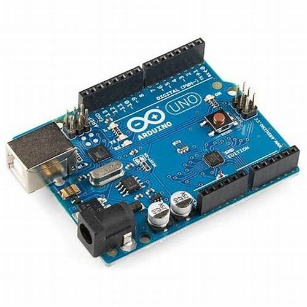
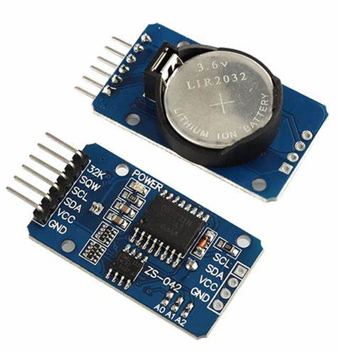

# 🌾 Smart Irrigation System based Time using Arduino and RTC🌾

**Sistem otomatis untuk pengelolaan penyiraman sawah menggunakan RTC, relay, dan antarmuka LCD Keypad Shield.**

---

## 📋 Deskripsi
Proyek ini memungkinkan pengguna mengontrol lima relay untuk mengatur aliran air ke sawah secara terjadwal dengan durasi tertentu. Sistem menggunakan RTC untuk memastikan penyiraman berjalan sesuai waktu yang diatur dan dilengkapi dengan LCD Keypad Shield untuk pengaturan parameter langsung dari perangkat.

---

## 🔑 Fitur Utama
- ⏰ **Penjadwalan Otomatis**: Waktu aktif dan durasi setiap relay dapat diatur.
- 💧 **Kontrol Multi-Relay**: Sistem mendukung hingga lima relay untuk membuka dan menutup katup air.
- 🖥️ **Antarmuka Pengguna**: Pengguna dapat mengatur waktu mulai, durasi, dan urutan relay melalui LCD Keypad Shield.
- 📖 **Penyimpanan Parameter**: Nilai parameter disimpan menggunakan EEPROM, sehingga tetap tersimpan meski perangkat mati.

---

## ⚙️ Komponen Utama
1. **Arduino Uno**: Mikrokontroler utama untuk mengontrol sistem.
   
3. **RTC DS3231**: Mengatur waktu penyiraman secara akurat.
   
5. **LCD Keypad Shield**: Sebagai antarmuka pengguna.
   
7. **Relay Modul**: Mengontrol katup air.
9. **Sumber Daya**: Adaptor 12V.

---

## 🛠️ Instalasi dan Pengaturan
1. **Rakit Sistem:**
   Hubungkan komponen sesuai deskripsi berikut:

   - **LCD Keypad Shield**:
     - Shield ini langsung dipasang pada Arduino Uno, sehingga semua pin yang dibutuhkan (pin digital dan analog) akan terhubung otomatis.

   - **RTC DS3231**:
     - Pin `VCC` RTC ke pin `5V` Arduino.
     - Pin `GND` RTC ke pin `GND` Arduino.
     - Pin `SCL` RTC ke pin `A5` Arduino.
     - Pin `SDA` RTC ke pin `A4` Arduino.

   - **Relay Modul (10 Relay)**:
     - Setiap relay memiliki dua kabel kontrol (`IN` dan `GND`):
       - Sambungkan `IN` masing-masing relay ke pin yang telah didefinisikan di kode:
         - **Relay untuk Membuka Valve**:
           - Relay 1: Pin `0`
           - Relay 2: Pin `2`
           - Relay 3: Pin `11`
           - Relay 4: Pin `13`
           - Relay 5: Pin `A2`
         - **Relay untuk Menutup Valve**:
           - Relay 6: Pin `1`
           - Relay 7: Pin `3`
           - Relay 8: Pin `12`
           - Relay 9: Pin `A1`
           - Relay 10: Pin `A3`
       - Sambungkan semua pin `GND` relay ke pin `GND` Arduino.
     - Sambungkan pin `VCC` relay ke pin `3,3V` Arduino atau sumber daya eksternal, jika dibutuhkan.

   - **Valve (Katup Air)**:
     - Sambungkan masing-masing katup air ke output relay yang sesuai. Pastikan konfigurasi relay dan valve konsisten dengan tujuan kontrol Anda (buka atau tutup).

2. **Unggah Kode Program:**
   - Gunakan Arduino IDE untuk mengunggah file `Relay Control.ino` ke Arduino Uno.
   - Pastikan pustaka berikut sudah diinstal di Arduino IDE:
     - `RTClib`
     - `LiquidCrystal`

3. **Konfigurasi Awal:**
   - Gunakan tombol pada LCD Keypad Shield untuk mengatur:
     - Waktu mulai penyiraman.
     - Durasi setiap relay.
     - Urutan penyiraman.

4. **Uji Sistem:**
   - Nyalakan sistem dan pastikan relay berfungsi sesuai pengaturan.

---

## 📜 Cara Kerja
1. Sistem membaca waktu dari RTC DS3231.
2. Saat waktu mulai tercapai:
   - Relay pertama diaktifkan sesuai durasi yang telah diatur.
   - Setelah durasi selesai, relay berikutnya diaktifkan secara berurutan.
3. Setelah relay terakhir selesai, semua relay dimatikan hingga siklus berikutnya dimulai.

---

## 📚 Lisensi
Proyek ini dilisensikan di bawah [MIT License](https://github.com/Sanssin/Smart-Irrigation-System-based-Time-using-Arduino-and-RTC/blob/main/LISENCE).

---

## 📧 Kontak
Untuk pertanyaan lebih lanjut, silakan hubungi **[Nur Ihsanudin](mailto:nurihsanudin13@gmail.com)**.

---

> "Otomasi sederhana untuk pertanian yang lebih produktif dan hemat sumber daya." 🌱
